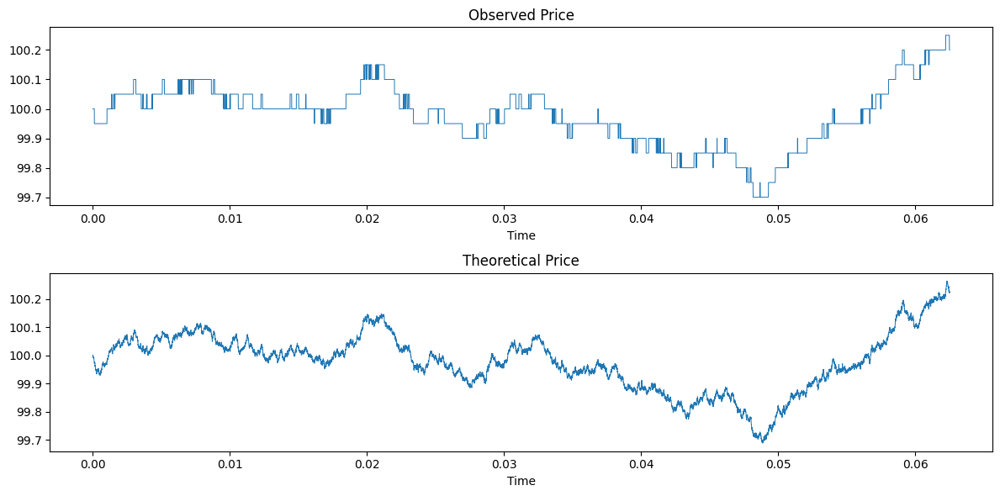

# 📈 HFT

Repository dedicated for the analysis of some papers on high frequency trading. Our work is done under the supervision of Professor Mathieu Rosenbaum in the course MAP511 - Initiation to Research of École Polytechnique.

  

## 📜 References

Here are the papers we used in our research as well as their corresponding folder/notebook where it was used:

[1] Robert Almgren and Neil Chriss (2000). Optimal Execution of Portfolio Transactions, Journal of Risk, DOI: 10.21314/JOR.2001.041. ([Paper](https://www.smallake.kr/wp-content/uploads/2016/03/optliq.pdf), [Notebook](https://github.com/nicolassinott/HFT/blob/main/notebooks/Optimal_Execution/simulation.ipynb))

[2] Lan Zhang, Per A Mykland \& Yacine Aït-Sahalia (2005). A Tale of Two Time Scales, Journal of the American Statistical Association, 100:472, 1394-1411, DOI: 10.1198/016214505000000169. ([Paper](https://www.tandfonline.com/doi/abs/10.1198/016214505000000169), [Notebook](https://github.com/nicolassinott/HFT/blob/main/notebooks/Integrated_volatility/monte_carlo.ipynb))

[3] Christian Y. Robert, Mathieu Rosenbaum (2011). A New Approach for the Dynamics of Ultra-High-Frequency Data: The Model with Uncertainty Zones, Journal of Financial Econometrics, Volume 9, Issue 2, Spring 2011, Pages 344–366. DOI: 10.1093/jjfinec/nbq023. ([Paper](https://doi.org/10.1093/jjfinec/nbq023), [Notebook](https://github.com/nicolassinott/HFT/blob/main/notebooks/Uncertainty_zones/model.ipynb))

[4] Robert, C. Y. and M. Rosenbaum (2011). Volatility and covariation estimation when microstructure noise and trading times are endogenous. Journal of Financial Econometrics 9 (2), 344–366. DOI: 10.1093/jjfinec/nbq023. ([Paper](https://onlinelibrary.wiley.com/doi/10.1111/j.1467-9965.2010.00454.x), [Notebook](https://github.com/nicolassinott/HFT/blob/main/notebooks/Uncertainty_zones/model.ipynb))

[5] Alfonsi, A. (2005). On the discretization schemes for the CIR (and Bessel squared) processes. Monte Carlo Methods and Applications, 11(4), 355-384. DOI: 10.1515/156939605777438569. ([Paper](https://doi.org/10.1515/156939605777438569), [Notebook](https://github.com/nicolassinott/HFT/blob/main/notebooks/Heston_Model/simulation.ipynb))

[6] Peter Carr and Dilip B. Madan (2000). Option valuation using the fast Fourier transform, Journal of Computational Finance, DOI: 10.21314/JCF.1999.043. ([Paper](https://www.risk.net/journal-of-computational-finance/2160495/option-valuation-using-the-fast-fourier-transform), [Notebook](https://github.com/nicolassinott/HFT/blob/main/notebooks/fft/model.ipynb))

[7] Kahl, C. and Jackel, P. (2005) Not-So-Complex Logarithms in the Heston Model. Wilmott Magazine, 19, 94-103. ([Paper](https://wilmott.com/not-so-complex-logarithms-in-the-heston-model/), [Notebook](https://github.com/nicolassinott/HFT/blob/main/notebooks/fft/model.ipynb))